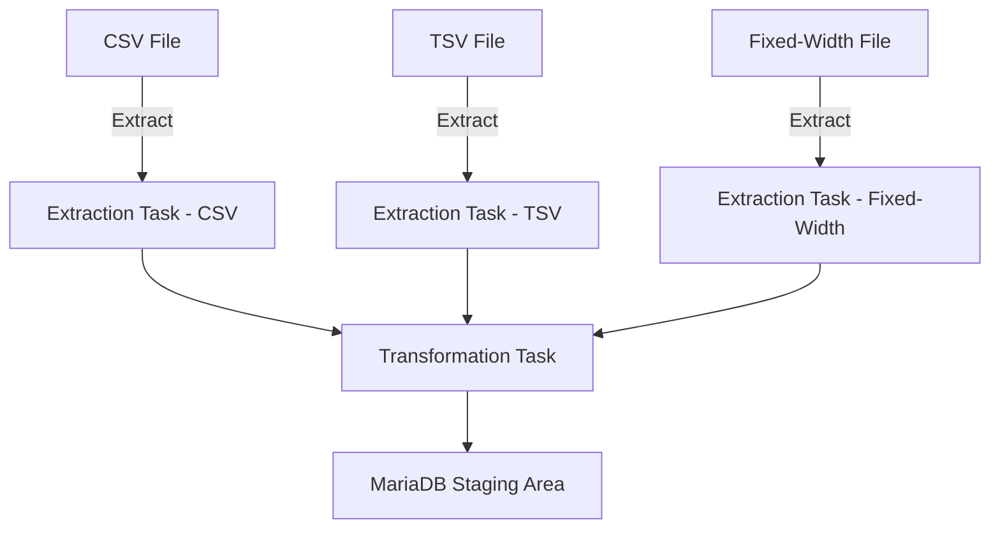

# Traffic-Data-Consolidation-with-Apache-Airflow  

## Project Overview: Decongesting National Highways by Analyzing Traffic Data  

I worked as a data engineer at a data analytics consulting company, where I was tasked with developing a solution to address traffic congestion on national highways. Traffic bottlenecks at toll plazas have a significant impact on daily commutes, logistics efficiency, and environmental sustainability due to prolonged vehicle idling. This project aimed to analyze and process traffic data collected from various toll plazas to uncover patterns and inefficiencies contributing to these delays.

Each highway is managed by a different toll operator, and the operators use unique IT systems that generate data in different file formats, including CSV, TSV, and fixed-width files. The inconsistency in data formats posed a challenge for centralized analysis, which I was tasked to resolve.

### My Role
In this project, I was responsible for designing and implementing a data pipeline to extract, transform, and load (ETL) traffic data from these diverse file formats into a unified staging area. I leveraged Apache Airflow to automate the pipeline, ensuring scalability and reliability. My role involved understanding the structure of each file format, standardizing the data, and integrating it into a single consolidated view for further analysis.

### Goals
The primary objectives of the project were as follows:
1. Extract data from three different file formats: CSV, TSV, and fixed-width files.
2. Transform the extracted data to achieve uniformity and compatibility for centralized analysis.
3. Load the transformed data into a structured staging area for downstream processing and analytics.

By the end of the project, I successfully automated the entire ETL process using an Apache Airflow DAG, showcasing my ability to handle complex data integration tasks and provide actionable insights for optimizing highway traffic operations.

---

# Technical Approach  

## Tools and Technologies  
For this project, I leveraged several key tools and technologies to implement a scalable and efficient data pipeline:  
- **Apache Airflow**: I used Apache Airflow to create a Directed Acyclic Graph (DAG) that automated the ETL process. This allowed me to schedule and monitor each step of the pipeline, ensuring smooth execution.
- **Python**: Python was used for data extraction, transformation, and loading. It was particularly helpful in processing CSV and TSV files using the `pandas` library.
- **pandas**: `pandas` was essential for reading and transforming the data from CSV and TSV formats into a standard structure.
- **WSL (Windows Subsystem for Linux)**: I developed and ran the DAG scripts in a WSL environment, ensuring compatibility with Linux-based tools and utilities.
- **BashOperator and PythonOperator**: I used these operators within Apache Airflow to run Bash and Python commands. The BashOperator helped with file extraction tasks, while the PythonOperator was used for handling data manipulation with `pandas`.

### Architecture  
The architecture for this project was centered around Apache Airflow to orchestrate the extraction, transformation, and loading (ETL) processes. The pipeline began by extracting data from the different file formats, including CSV, TSV, and fixed-width files. For each file format, separate tasks were designed in the Airflow DAG:
- **Extraction**: Data was first extracted using the BashOperator for Bash scripts (e.g., untaring compressed files and preparing them for processing) and the PythonOperator to process the files using `pandas` for CSV and TSV files.
- **Transformation**: Once the data was extracted, it was transformed using Python scripts. The transformation steps ensured that the data was cleaned, standardized, and formatted correctly to ensure consistency across the various toll operators’ datasets.
- **Loading**: The transformed data was then loaded into a staging area where it was stored temporarily for further analysis. This area acted as a central repository for all the processed data, ready for deeper insights.

### Challenges  
One of the main challenges I faced was dealing with the inconsistency of the data formats across different toll operators. Each file format—CSV, TSV, and fixed-width—required a unique extraction and transformation process. I had to handle different encodings and delimiters, ensuring that all data could be integrated seamlessly. Additionally, some files were very large, which required careful memory management during processing to avoid performance bottlenecks.  
Another challenge was setting up and configuring Apache Airflow on WSL. I had to ensure that the DAG tasks ran smoothly, and dependencies between Python and Bash operators were correctly established.

## Steps in the Process  
1. **Download and Extract Files**:  
   I first downloaded the `.tgz` file containing the raw traffic data. Using the BashOperator, I untarred the file using the Bash command:  
   ```bash
   tar -xvzf traffic_data.tgz
   ```
2. **Inspection of File Formats**
After extracting the files, I examined their content to understand the structure of each file format (CSV, TSV, and fixed-width). This step was important to determine the appropriate methods for reading and transforming the data based on their structure and delimiters.

3. **Data Extraction**
I then created separate tasks within the Airflow DAG to extract data from each file format:

- ***For CSV and TSV files***: I used the PythonOperator with pandas to read and load the data. Here’s an example of how I read a CSV file:
  ```bash
  import pandas as pd
  data = pd.read_csv('path_to_csv_file.csv')
  ```
- ***For Fixed-Width Files***: I used the BashOperator to process the data. The Bash script extracted and prepared the data before passing it to Python for further transformation.
4. **Data Transformation and Loading**
After extracting the data, I used Python scripts to clean and transform it into a consistent format:

- Standardizing column names to ensure uniformity across datasets.
---


  ## Solution Architecture  

To achieve the goal of consolidating traffic data from various toll plazas, I designed an architecture that automates the ETL process. I used Apache Airflow to orchestrate the workflow and ensure each step was executed in a systematic and efficient manner.  

### 1. Data Flow Overview  
I structured the ETL pipeline into three distinct phases to handle the complexity of working with multiple file formats:  

- **Extraction**:  
  I began by extracting data from three file formats—CSV, TSV, and fixed-width files. Each format required a tailored approach due to differences in delimiters and field structures. I created separate tasks in Apache Airflow to handle these file types, ensuring accurate and consistent extraction.  

- **Transformation**:  
  After extracting the raw data, I focused on cleaning and standardizing it. I transformed the data by renaming columns for consistency, handling missing values, and converting data types where necessary. These steps ensured compatibility between datasets from different toll operators.  

- **Loading**:  
  I completed the pipeline by loading the transformed data into the staging area, which I implemented using MariaDB. This database serves as the final repository for the cleaned data, making it accessible for further analysis.  

### 2. Pipeline Orchestration with Apache Airflow  
To orchestrate the ETL process, I used Apache Airflow to build a Directed Acyclic Graph (DAG). This allowed me to define and automate the sequence of tasks, ensuring smooth execution.  

- **Tasks and Operators**:  
  I used a combination of operators in Airflow to implement each stage of the pipeline:  
  - **BashOperator**:  
    I employed the BashOperator to execute shell commands, such as extracting `.tgz` files containing the traffic data.  
  - **PythonOperator**:  
    I used the PythonOperator for data processing tasks. With Python scripts and the `pandas` library, I efficiently read and transformed the datasets. These operators allowed me to create a flexible and robust pipeline.  

### 3. Staging Area Design  
I chose MariaDB as the staging area for storing the consolidated data. This database was ideal for maintaining the structured format of the transformed data. By organizing the data in a centralized repository, I ensured it was ready for analysis. My decision to use MariaDB was driven by its reliability and seamless integration with my environment.  

### 4. Visualizing the Architecture  
To simplify the understanding of this architecture, I created a flowchart that visually represents the pipeline. This diagram illustrates:  
- The data sources (CSV, TSV, and fixed-width files).  
- The extraction tasks for each file type.  
- The transformation process, including operations like column renaming and data type conversion.  
- The loading stage into MariaDB as the staging area.  

Below is a visual representation of the ETL pipeline architecture:  



## Step-by-Step Implementation

### File Setup


I began by creating a staging folder and granting it access so it can temporarily hold intermediate and final outputs during the ETL process. this was achieved by the following command 
```bash
sudo mkdir -p /root/airflow/dags/python_etl/staging
sudo chmod -R 777 /root/airflow/dags/python_etl
```

I also created the main script for the ETL process, named `ETL_toll_pyhton_data.py`, placed in the `/root` directory usibg the command 
```bash
touch ETL_toll_pyhton_data.py
```
This script serves as the backbone of the pipeline, orchestrating tasks for extracting, transforming, and loading the data. 

### Data Extraction

#### Overview
The extraction process involved handling three different file formats: CSV, TSV, and fixed-width files. Each format required a unique approach to read and extract relevant fields.
Here i needed to see the shape of the downloaded data, study it and deduced the fact that the data in all the tables have no Headers and are of 4 categories. This gave me an insgight about the characteristics of the data and the best apprach at extracting it.

#### Implementation Details

1. **Downloading the Dataset**
   I created a Python function, `download_dataset`, to fetch the dataset from the given URL and save it to the staging directory.
   
   - **Source:** https://cf-courses-data.s3.us.cloud-object-storage.appdomain.cloud/IBM-DB0250EN-SkillsNetwork/labs/Final%20Assignment/tolldata.tgz
   - **Destination:** `/root/airflow/dags/python_etl/staging`

2. **Untarring the Dataset**
   The `untar_dataset` function was implemented to untar the downloaded dataset into the staging directory, ensuring all files were available for subsequent steps.

3. **Extracting Data**
   - **From CSV:** Using the `extract_data_from_csv` function, I extracted fields like Rowid, Timestamp, Anonymized Vehicle number, and Vehicle type from `vehicle-data.csv`. These were saved to `csv_data.csv`.
   - **From TSV:** With the `extract_data_from_tsv` function, I extracted Number of axles, Tollplaza id, and Tollplaza code from `tollplaza-data.tsv`. These were saved to `tsv_data.csv`.
   - **From Fixed-Width File:** The `extract_data_from_fixed_width` function handled `payment-data.txt`, extracting Type of Payment code and Vehicle Code into `fixed_width_data.csv`.

### Data Transformation

#### Consolidation
Using the `consolidate_data` function, I combined the extracted data into a single file, `extracted_data.csv`. The consolidated file contained fields in the following order:

- Rowid
- Timestamp
- Anonymized Vehicle number
- Vehicle type
- Number of axles
- Tollplaza id
- Tollplaza code
- Type of Payment code
- Vehicle Code

#### Transformation
The `transform_data` function transformed the Vehicle type field to uppercase for uniformity and saved the result as `transformed_data.csv` in the staging directory.

## Data Loading

To complete the pipeline, I implemented a `load_data_to_mariadb` function to load the final `transformed_data.csv` into the MariaDB database. The database, `traffic_db`, had a table structure defined to align with the fields in the consolidated data.

### DAG Script

The entire ETL process was managed through an Apache Airflow DAG. Each Python function was assigned as a task in the DAG. The pipeline ensured that each task executed in the proper sequence:

1. **Task 1:** Download dataset
2. **Task 2:** Untar dataset
3. **Task 3:** Extract data from CSV, TSV, and fixed-width files
4. **Task 4:** Consolidate data
5. **Task 5:** Transform data
6. **Task 6:** Load data to MariaDB

Dependencies were explicitly set in the DAG to enforce the correct execution order, ensuring data consistency and integrity throughout the pipeline.

#### ETL Airflow DAG Script

The DAG script for this project automates the extraction, transformation, and loading of traffic data from multiple formats into a consolidated dataset. Below is the detailed script:

```python
from airflow import DAG
from airflow.operators.python import PythonOperator
from datetime import datetime
import os
import pandas as pd
import tarfile
import mariadb

# Define the paths
source_url = "https://cf-courses-data.s3.us.cloud-object-storage.appdomain.cloud/IBM-DB0250EN-SkillsNetwork/labs/Final%20Assignment/tolldata.tgz"
staging_dir = "/root/airflow/dags/python_etl/staging"
os.makedirs(staging_dir, exist_ok=True)

# Define default arguments
default_args = {
    'owner': 'airflow',
    'start_date': datetime(2024, 12, 19),
}

# DAG definition
with DAG(
    dag_id='ETL_toll_data_pipeline',
    default_args=default_args,
    schedule_interval=None,
    catchup=False,
) as dag:

    def download_dataset():
        import requests
        response = requests.get(source_url)
        with open(f"{staging_dir}/tolldata.tgz", "wb") as file:
            file.write(response.content)

    def untar_dataset():
        with tarfile.open(f"{staging_dir}/tolldata.tgz") as tar:
            tar.extractall(path=staging_dir)

    def extract_data_from_csv():
        # Define column names based on the actual data structure
        column_names = ['Rowid', 'Timestamp', 'Anonymized Vehicle number', 'Vehicle type', 'Integer Field', 'Identifier']
        
        # Load the data with the specified column names
        df = pd.read_csv(f"{staging_dir}/vehicle-data.csv", header=None, names=column_names)
        
        # Select the required columns
        df[['Rowid', 'Timestamp', 'Anonymized Vehicle number', 'Vehicle type']].to_csv(
            f"{staging_dir}/csv_data.csv", index=False)


    def extract_data_from_tsv():
        # Define column names based on the actual data structure
        column_names = ['Rowid', 'Timestamp', 'Anonymized Vehicle number', 'Vehicle type', 
                        'Integer Field', 'Tollplaza ID', 'Tollplaza Code']
        
        # Load the data with the specified column names
        df = pd.read_csv(f"{staging_dir}/tollplaza-data.tsv", sep='\t', header=None, names=column_names)
        
        # Select the required columns
        df[['Tollplaza ID', 'Tollplaza Code', 'Integer Field']].to_csv(
            f"{staging_dir}/tsv_data.csv", index=False)


    def extract_data_from_fixed_width():
        column_specs = [(0, 10), (10, 20)]
        df = pd.read_fwf(f"{staging_dir}/payment-data.txt", colspecs=column_specs, header=None)
        df.columns = ['Type of Payment code', 'Vehicle Code']
        df.to_csv(f"{staging_dir}/fixed_width_data.csv", index=False)

    def consolidate_data():
        csv_data = pd.read_csv(f"{staging_dir}/csv_data.csv")
        tsv_data = pd.read_csv(f"{staging_dir}/tsv_data.csv")
        fixed_width_data = pd.read_csv(f"{staging_dir}/fixed_width_data.csv")
        final_data = pd.concat([csv_data, tsv_data, fixed_width_data], axis=1)
        final_data.to_csv(f"{staging_dir}/extracted_data.csv", index=False)

    def transform_data():
        df = pd.read_csv(f"{staging_dir}/extracted_data.csv")
        df['Vehicle type'] = df['Vehicle type'].str.upper()
        df.to_csv(f"{staging_dir}/transformed_data.csv", index=False)

    def load_to_mariadb():
        conn = mariadb.connect(
            host='localhost',
            user='root',
            password='nnannaeze@77',
            database='traffic_db'
        )
        cursor = conn.cursor()
        cursor.execute(""" 
            CREATE TABLE IF NOT EXISTS traffic_data (
                Rowid INT,
                Timestamp VARCHAR(255),
                Anonymized_Vehicle_number VARCHAR(255),
                Vehicle_type VARCHAR(255),
                Number_of_axles INT,
                Tollplaza_id VARCHAR(255),
                Tollplaza_code VARCHAR(255),
                Type_of_Payment_code VARCHAR(255),
                Vehicle_Code VARCHAR(255)
            )
        """)
        conn.commit()

        df = pd.read_csv(f"{staging_dir}/transformed_data.csv")
        for _, row in df.iterrows():
            cursor.execute(""" 
                INSERT INTO traffic_data VALUES (%s, %s, %s, %s, %s, %s, %s, %s, %s)
            """, tuple(row))
        conn.commit()
        conn.close()

    # Define tasks
    task_download = PythonOperator(
        task_id='download_dataset',
        python_callable=download_dataset,
    )

    task_untar = PythonOperator(
        task_id='untar_dataset',
        python_callable=untar_dataset,
    )

    task_extract_csv = PythonOperator(
        task_id='extract_data_from_csv',
        python_callable=extract_data_from_csv,
    )

    task_extract_tsv = PythonOperator(
        task_id='extract_data_from_tsv',
        python_callable=extract_data_from_tsv,
    )

    task_extract_fixed_width = PythonOperator(
        task_id='extract_data_from_fixed_width',
        python_callable=extract_data_from_fixed_width,
    )

    task_consolidate = PythonOperator(
        task_id='consolidate_data',
        python_callable=consolidate_data,
    )

    task_transform = PythonOperator(
        task_id='transform_data',
        python_callable=transform_data,
    )

    task_load = PythonOperator(
        task_id='load_to_mariadb',
        python_callable=load_to_mariadb,
    )

    # Set task dependencies
    task_download >> task_untar >> [task_extract_csv, task_extract_tsv, task_extract_fixed_width] >> task_consolidate >> task_transform >> task_load
```
## Challenges and Solutions

Throughout the development of this ETL pipeline, several challenges arose, primarily related to missing dependencies, file path issues, and Airflow task scheduling. Below are the challenges faced, the steps taken to enter the Airflow environment, and how the issues were resolved:

### Entering the Airflow Environment
Before resolving any issues, it was crucial to work within the Airflow virtual environment to ensure that all commands and configurations were executed in the correct context. The Airflow environment was activated using the following commands:
```bash
source /root/airflow_venv/bin/activate
```
Once inside the environment, all subsequent commands and solutions were executed.

### Challenges and Solutions

#### Missing Module Errors (e.g., `pandas` and `mysql-connector-python`)  
During the execution of the pipeline script, errors related to missing Python libraries were encountered. For example, the `ModuleNotFoundError` was raised for `pandas` and `mysql-connector-python`.

**Solution:**  
To resolve this, the missing libraries were installed within the virtual environment using the following commands:  
```bash
pip install pandas
pip install mysql-connector-python
pip install mariadb
```
After these installations, the script was able to proceed without errors.
#### Incorrect File Path for the Airflow DAG  
The Airflow UI initially did not display the DAG because the script was located outside the `/root/airflow/dags/` directory.

**Solution:**  
The script was relocated to the correct directory using the following commands:  
```bash
rm /root/airflow/dags/ETL_toll_pyhton_data.py  # Remove incorrect file
mv /root/ETL_toll_pyhton_data.py /root/airflow/dags/  # Move file to correct directory
```
After relocating the file, the DAG appeared in the Airflow UI as expected.

### 6. Testing and Validation  

#### Testing the Pipeline in Apache Airflow  
To ensure that the Airflow pipeline operated correctly, the following steps were performed:  

1. **Environment Check:**  
   We entered the Airflow virtual environment to verify all dependencies and configurations were intact.  
   ```bash
   source airflow_venv/bin/activate
   ```
2. **Listing Tasks:**
   The DAG's tasks were listed to confirm that all task definitions were correctly registered:
   ```bash
   airflow tasks list ETL_toll_data_pipeline
   ```
   ### Output
   ```
   consolidate_data
   download_dataset
   extract_data_from_csv
   extract_data_from_fixed_width
   extract_data_from_tsv
   load_to_mariadb
   transform_data
   untar_dataset
   ```
   

3. **Airflow Scheduler Validation:**
   After starting the scheduler, I verified it was running and processing DAGs:
   ```bash
   airflow scheduler
   ```
   
   
5. **Airflow Webserver Validation:**
   After starting the webserver, I verified it was running and processing DAGs:
   ```bash
   airflow webserver -p 8080
   ```
   
   
6. **Running the DAG:**
   Triggered the DAG from the UI and monitored the execution of each task.
   
   
   
   


## Results

By running the `ETL_toll_data.py` DAG script, I achieved the following:

- Successfully extracted and transformed data from multiple formats.
- Consolidated the data into a standardized structure.
- Loaded the transformed data into MariaDB for further analysis.

Would you like me to further enhance this section with code snippets or diagrams?


