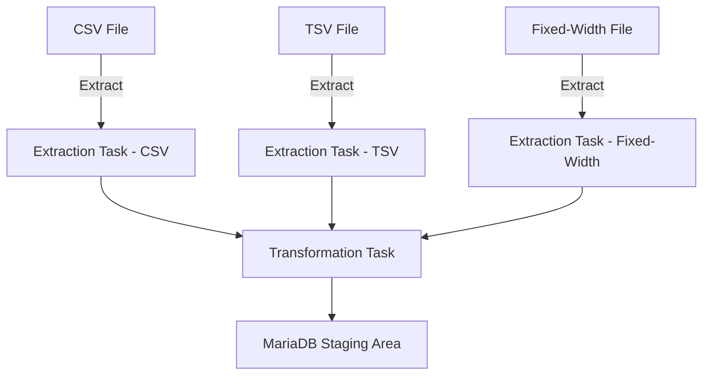

# Traffic-Data-Consolidation-with-Apache-Airflow  

## Project Overview: Decongesting National Highways by Analyzing Traffic Data  

I worked as a data engineer at a data analytics consulting company, where I was tasked with developing a solution to address traffic congestion on national highways. Traffic bottlenecks at toll plazas have a significant impact on daily commutes, logistics efficiency, and environmental sustainability due to prolonged vehicle idling. This project aimed to analyze and process traffic data collected from various toll plazas to uncover patterns and inefficiencies contributing to these delays.

Each highway is managed by a different toll operator, and the operators use unique IT systems that generate data in different file formats, including CSV, TSV, and fixed-width files. The inconsistency in data formats posed a challenge for centralized analysis, which I was tasked to resolve.

### My Role
In this project, I was responsible for designing and implementing a data pipeline to extract, transform, and load (ETL) traffic data from these diverse file formats into a unified staging area. I leveraged Apache Airflow to automate the pipeline, ensuring scalability and reliability. My role involved understanding the structure of each file format, standardizing the data, and integrating it into a single consolidated view for further analysis.

### Goals
The primary objectives of the project were as follows:
1. Extract data from three different file formats: CSV, TSV, and fixed-width files.
2. Transform the extracted data to achieve uniformity and compatibility for centralized analysis.
3. Load the transformed data into a structured staging area for downstream processing and analytics.

By the end of the project, I successfully automated the entire ETL process using an Apache Airflow DAG, showcasing my ability to handle complex data integration tasks and provide actionable insights for optimizing highway traffic operations.

---

# Technical Approach  

## Tools and Technologies  
For this project, I leveraged several key tools and technologies to implement a scalable and efficient data pipeline:  
- **Apache Airflow**: I used Apache Airflow to create a Directed Acyclic Graph (DAG) that automated the ETL process. This allowed me to schedule and monitor each step of the pipeline, ensuring smooth execution.
- **Python**: Python was used for data extraction, transformation, and loading. It was particularly helpful in processing CSV and TSV files using the `pandas` library.
- **pandas**: `pandas` was essential for reading and transforming the data from CSV and TSV formats into a standard structure.
- **WSL (Windows Subsystem for Linux)**: I developed and ran the DAG scripts in a WSL environment, ensuring compatibility with Linux-based tools and utilities.
- **BashOperator and PythonOperator**: I used these operators within Apache Airflow to run Bash and Python commands. The BashOperator helped with file extraction tasks, while the PythonOperator was used for handling data manipulation with `pandas`.

### Architecture  
The architecture for this project was centered around Apache Airflow to orchestrate the extraction, transformation, and loading (ETL) processes. The pipeline began by extracting data from the different file formats, including CSV, TSV, and fixed-width files. For each file format, separate tasks were designed in the Airflow DAG:
- **Extraction**: Data was first extracted using the BashOperator for Bash scripts (e.g., untaring compressed files and preparing them for processing) and the PythonOperator to process the files using `pandas` for CSV and TSV files.
- **Transformation**: Once the data was extracted, it was transformed using Python scripts. The transformation steps ensured that the data was cleaned, standardized, and formatted correctly to ensure consistency across the various toll operators’ datasets.
- **Loading**: The transformed data was then loaded into a staging area where it was stored temporarily for further analysis. This area acted as a central repository for all the processed data, ready for deeper insights.

### Challenges  
One of the main challenges I faced was dealing with the inconsistency of the data formats across different toll operators. Each file format—CSV, TSV, and fixed-width—required a unique extraction and transformation process. I had to handle different encodings and delimiters, ensuring that all data could be integrated seamlessly. Additionally, some files were very large, which required careful memory management during processing to avoid performance bottlenecks.  
Another challenge was setting up and configuring Apache Airflow on WSL. I had to ensure that the DAG tasks ran smoothly, and dependencies between Python and Bash operators were correctly established.

## Steps in the Process  
1. **Download and Extract Files**:  
   I first downloaded the `.tgz` file containing the raw traffic data. Using the BashOperator, I untarred the file using the Bash command:  
   ```bash
   tar -xvzf traffic_data.tgz
   ```
2. **Inspection of File Formats**
After extracting the files, I examined their content to understand the structure of each file format (CSV, TSV, and fixed-width). This step was important to determine the appropriate methods for reading and transforming the data based on their structure and delimiters.

3. **Data Extraction**
I then created separate tasks within the Airflow DAG to extract data from each file format:

- ***For CSV and TSV files***: I used the PythonOperator with pandas to read and load the data. Here’s an example of how I read a CSV file:
  ```bash
  import pandas as pd
  data = pd.read_csv('path_to_csv_file.csv')
  ```
- ***For Fixed-Width Files***: I used the BashOperator to process the data. The Bash script extracted and prepared the data before passing it to Python for further transformation.
4. **Data Transformation and Loading**
After extracting the data, I used Python scripts to clean and transform it into a consistent format:

- Standardizing column names to ensure uniformity across datasets.
---


  ## Solution Architecture  

To achieve the goal of consolidating traffic data from various toll plazas, I designed an architecture that automates the ETL process. I used Apache Airflow to orchestrate the workflow and ensure each step was executed in a systematic and efficient manner.  

### 1. Data Flow Overview  
I structured the ETL pipeline into three distinct phases to handle the complexity of working with multiple file formats:  

- **Extraction**:  
  I began by extracting data from three file formats—CSV, TSV, and fixed-width files. Each format required a tailored approach due to differences in delimiters and field structures. I created separate tasks in Apache Airflow to handle these file types, ensuring accurate and consistent extraction.  

- **Transformation**:  
  After extracting the raw data, I focused on cleaning and standardizing it. I transformed the data by renaming columns for consistency, handling missing values, and converting data types where necessary. These steps ensured compatibility between datasets from different toll operators.  

- **Loading**:  
  I completed the pipeline by loading the transformed data into the staging area, which I implemented using MariaDB. This database serves as the final repository for the cleaned data, making it accessible for further analysis.  

### 2. Pipeline Orchestration with Apache Airflow  
To orchestrate the ETL process, I used Apache Airflow to build a Directed Acyclic Graph (DAG). This allowed me to define and automate the sequence of tasks, ensuring smooth execution.  

- **Tasks and Operators**:  
  I used a combination of operators in Airflow to implement each stage of the pipeline:  
  - **BashOperator**:  
    I employed the BashOperator to execute shell commands, such as extracting `.tgz` files containing the traffic data.  
  - **PythonOperator**:  
    I used the PythonOperator for data processing tasks. With Python scripts and the `pandas` library, I efficiently read and transformed the datasets. These operators allowed me to create a flexible and robust pipeline.  

### 3. Staging Area Design  
I chose MariaDB as the staging area for storing the consolidated data. This database was ideal for maintaining the structured format of the transformed data. By organizing the data in a centralized repository, I ensured it was ready for analysis. My decision to use MariaDB was driven by its reliability and seamless integration with my environment.  

### 4. Visualizing the Architecture  
To simplify the understanding of this architecture, I created a flowchart that visually represents the pipeline. This diagram illustrates:  
- The data sources (CSV, TSV, and fixed-width files).  
- The extraction tasks for each file type.  
- The transformation process, including operations like column renaming and data type conversion.  
- The loading stage into MariaDB as the staging area.  

Below is a visual representation of the ETL pipeline architecture:  




